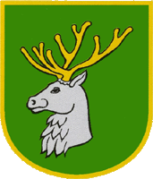
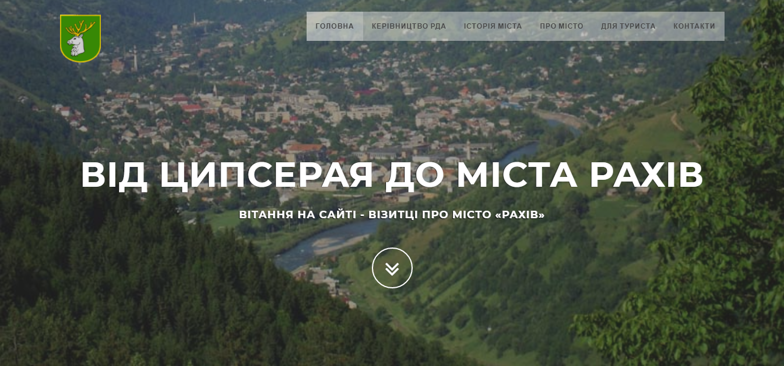
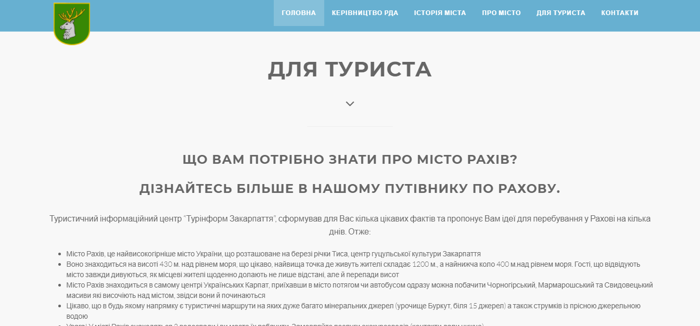
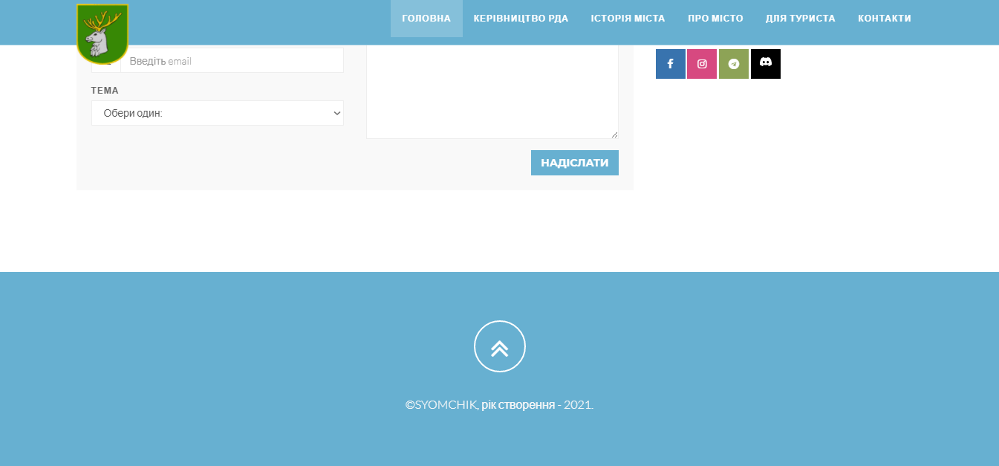
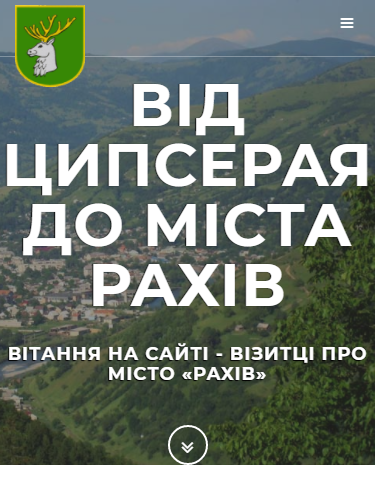
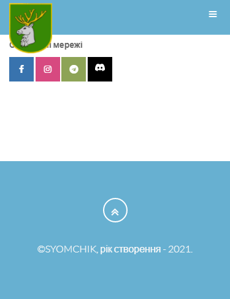

<p align="center"></p>
<h1 align="center">"ВІД ЦИПСЕРАЯ ДО МІСТА РАХІВ"</h1>

## Description
<b>EN:</b>

This is a course project that I was ordered.

The project visualizes the work of the site (landing) with publications for the tourist for the city of **Rakhiv**. No **API** usage, just the frontend for now.

<b>UA:</b>

Це курсовий проект який в мене заказали.

Проект візуалізує роботу сайту (лендінг) з публікаціями для туриста для міста **Рахів**. Без використання **API**, поки що лише інтерфейс.

#
## Screenshots
<p>
  
  
  
</p>
<p>
  
  
  
</p>

#
## Technologies used
<b>EN:</b>
- Using **Bootstrap** (front-end framework)
- Using a third-party template for site layout (built on **Bootstrap**)
- Navigation on the site

<b>UA:</b>
- Використання **Bootstrap** (front-end framework)
- Використання стороннього шаблону для макета сайту (на основі **Bootstrap**)
- Навігація по сайту

#
## License
```
© 2022, CoolOtaku (ericspz531@gmail.com)
```
